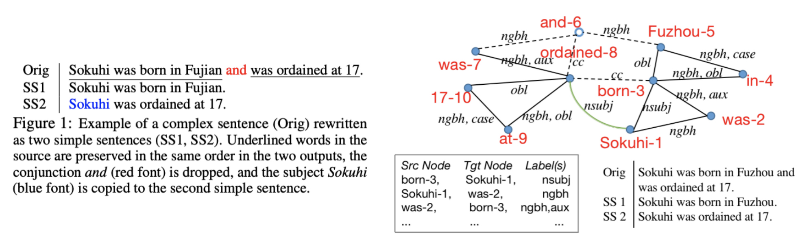

# ABCD: A Graph Framework to Convert Complex Sentences to a Covering Set of Simple Sentences -- ACL 2021 

Copyright (c) 2021 Yanjun Gao 

## Introduction 
ABCD is a linguistically motivated sentence editor that decomposes a complex sentence into N simple sentences, where N corresponds to the number of predicates in the complex sentence. It first constructs a sentence graph using dependency parsing information, and edits the graph into subgraphs by a neural classifier with four graph operations: A(accept), B(break), C(copy) and D(drop). This work appears in ACL 2021 and see paper for more details. 

We provide ABCD model trained on MinWiki (Wikipedia Text). You could test this pre-trained model on your data. If you are interested in training your ABCD model, we provide scripts of doing so. 



### Table of Contents
**[Dependencies](#dependencies)**<br>
**[Prerequisites](#prerequisites)**<br>
**[Testing](#test)**<br>
**[Training](#train)**<br>


## Dependencies
python 3.6, pytorch 1.6.0, numpy, nltk (word tokenize and sent tokenze), networkx, dgl, pickle, torchtext. 

## Prerequisites:

### Install Stanford CoreNLP (new version 4.20)[Link](https://stanfordnlp.github.io/CoreNLP/index.html) and Generate Dependency Parses with CoreNLP 
ABCD relies on external package to generate dependency parses. Here we use Stanford Corenlp. Output is a ".out file". E.g., the input file is "test.complex", then output file is "test.complex.out". Input file should have one sentence per line. If you see special characters in your text, please remove them otherwise it might cause token errors in preprocessing. 

There are many commands to run the stanford CoreNLP. E.g. the following could generate the .out file with enhanced dependency parse: 
```
java -cp "*" edu.stanford.nlp.pipeline.StanfordCoreNLP -file $filename 
```

### Get Pre-trained Word Embeddings
ABCD uses pre-trained GloVe embeddings (100d) to initialize the word representation. To download the embedding, go to [GloVe website](https://nlp.stanford.edu/projects/glove/) and download glove.6B.zip.   


## Testing 

### Step 1: Download pretrained model from these links:
Default is the ABCD model trained on Minwiki, with MLP classifier [Link](https://drive.google.com/file/d/146NQ9vx5GOcHn1geGI-WgjGEJ-RE5w-4/view?usp=sharing), or with Bilinear classifier [Link](https://drive.google.com/file/d/1I11gAVngLSaTJASYr9zyUCAiRhnkWx8f/view?usp=sharing) 


### Step 2: Run your CoreNLP output data with a preprocessor:

```
python process_test.py 
```
Output is a pickle file, with sentence ids as keys, preprocssed graph as values. You could change the filename and data directory in line 23-24 (variable batch_id and data_path). Currently the data loader will read from data/test.pkl as its default setting. 

### Step 3: Run the ABCD parser with pretrained models. 
```
python test.py 
```
Remember to modify ``root_dir`` (code directory), ``data_filename`` (the input .pkl filename after preprocessing) and ``glove_dir`` (where you store glove.6B.100d.txt). Also modify the ``pretrained_path`` to specify the folder of pretrained models, and ``classifer`` for the type of classfier the pre-trained model using. Output of this script is a pickle file storing a output dictionary where the keys are sentence indices and values are predicted strings and action predictions. Another argument output_str_to_file is set to True to generate clean output txt file. 


## Training
We provide scripts to help you train your ABCD model. You need to run your data through stanford CoreNLP first. 

### Step 1:  Run your CoreNLP output data with a preprocessor:
```
python process_data.py # different preprocessor than test time 
```

### Step 2:  Train the ABCD model using main.py 
```
python main.py 
```
Remember to change the ``root_dir`` and ``glove_dir``. 
